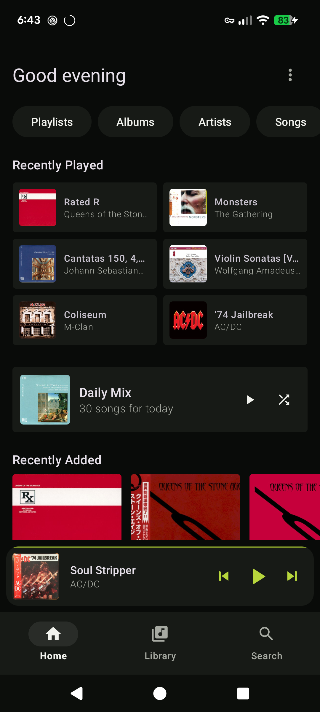
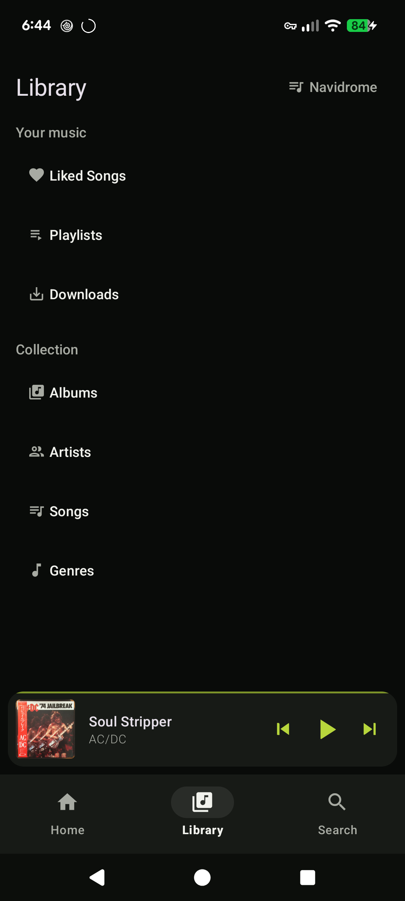
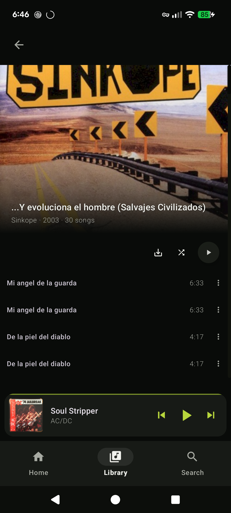
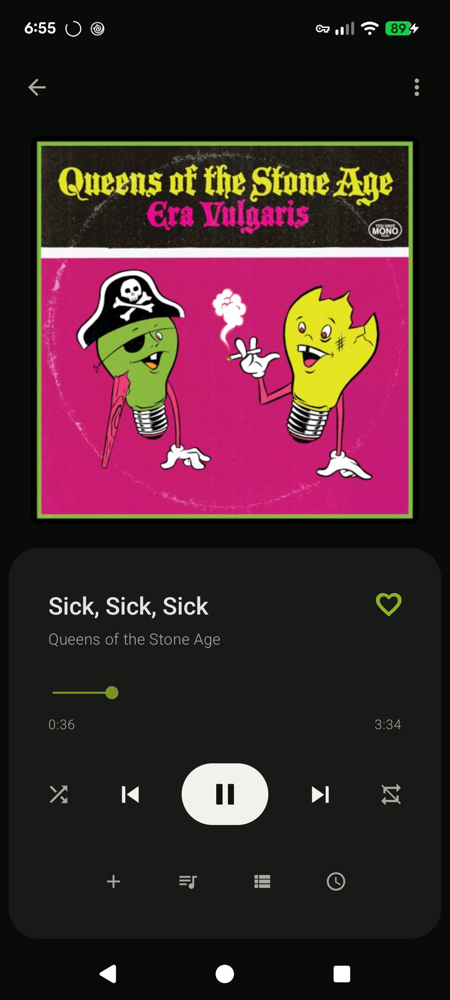
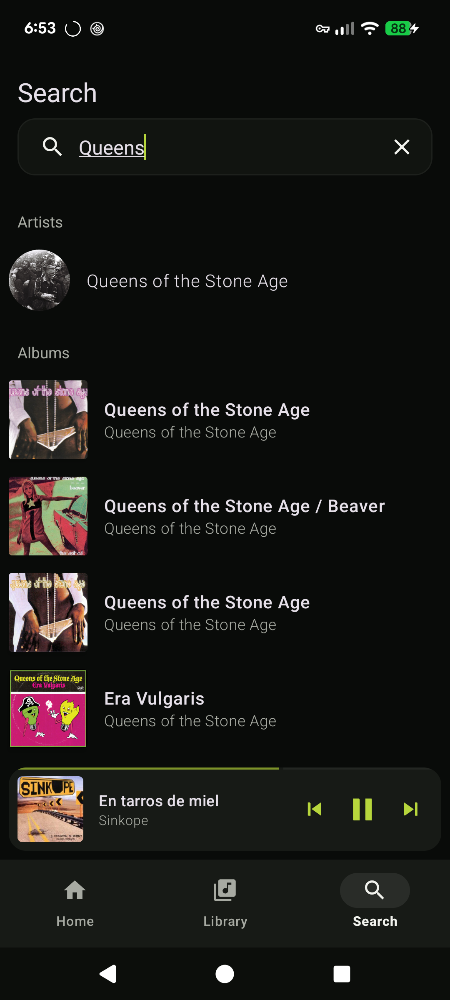

# Taki

**Your music, without distractions.**

Taki is a focused Android music player for [Navidrome](https://www.navidrome.org/) and other OpenSubsonic/Subsonic-compatible servers. Its goal is deliberately simple: open your library, find music, press play, and keep a few things available offline.

Taki is intentionally **music-only**. It leaves out chat, social features, sharing, podcasts, and day-to-day server administration so the player can stay centered on focused listening.

> **Beta:** The first Taki beta has not been released yet. Official builds will be published through this repository's GitHub Releases. Downloads from the original Ultrasonic project are not Taki releases.

## Screenshots

<p align="center">
  
  
  
  
  
</p>

## What it does

- Stream albums, artists, playlists, songs, genres, and liked music
- Download music for offline playback
- Search across your library and connect multiple compatible servers
- Integrate with Android media controls and Android Auto
- Keep everyday listening separate from server administration

## What it deliberately leaves out

Taki is built around simplification rather than feature accumulation. Chat, social feeds, sharing features, podcasts, and similar extras are intentionally outside the listening experience. The aim is a small, direct player for people who mainly want to listen to their own music.

## Requirements

- Android 8.0 (API 26) or later
- A Navidrome or compatible OpenSubsonic/Subsonic server

Compatibility varies between server implementations and API versions. Navidrome is the primary compatibility target for the beta.

## Install / Download

The first beta has not been published yet. When a release is available, official builds will be attached to [GitHub Releases](https://github.com/churipakinti/taki-android/releases). Until then, Taki can be built from source.

## Build from source

Install a recent Android Studio and Android SDK, clone the repository, then run:

```shell
./gradlew :ultrasonic:assembleDebug
```

The APK is generated under `ultrasonic/build/outputs/apk/debug/`. The module and Kotlin package retain the legacy `ultrasonic` and `org.moire.ultrasonic` names for compatibility.

## Reporting bugs

Use the [issue tracker](https://github.com/churipakinti/taki-android/issues) for reproducible problems. Do not post credentials, private server URLs, or sensitive logs. Security and privacy concerns should follow [SECURITY.md](SECURITY.md).

## Contributing

Issues and contributions are welcome. For larger changes, opening an issue first helps keep the scope aligned with Taki's deliberately simple, music-only direction. See [docs/CONTRIBUTING.md](docs/CONTRIBUTING.md) for repository guidelines.

## Project status

Taki is independently maintained as a personal open-source project. It is not offered as a commercial service and is not a company-backed product. This describes the project itself and does not add restrictions beyond the GPLv3 license.

## Credits and License

Taki started as a fork of [Ultrasonic](https://gitlab.com/ultrasonic/ultrasonic) and is free and open-source software distributed under the [GNU General Public License v3](LICENSE). Copyright in upstream portions remains with the respective Ultrasonic contributors. They are not responsible for Taki-specific changes, releases, support, or defects. See [NOTICE.md](NOTICE.md) for full attribution.
